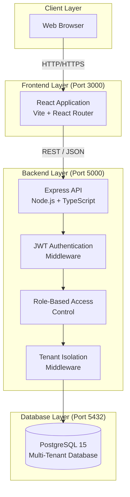
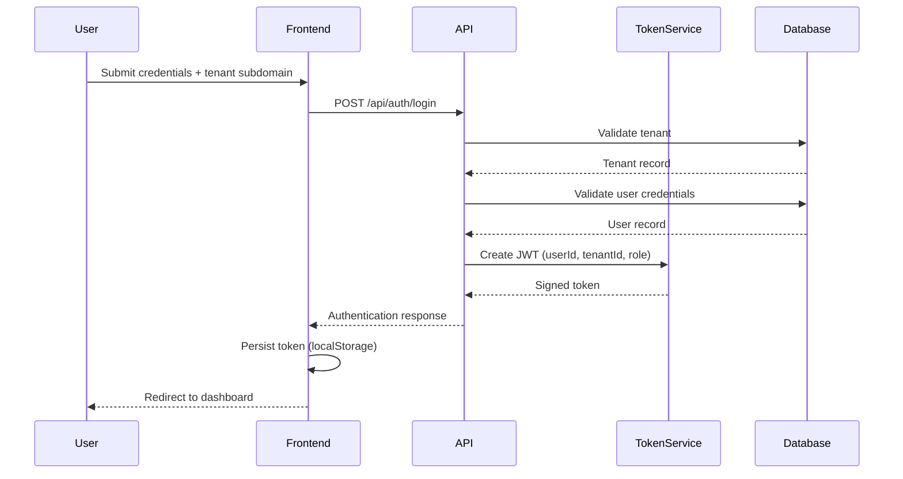
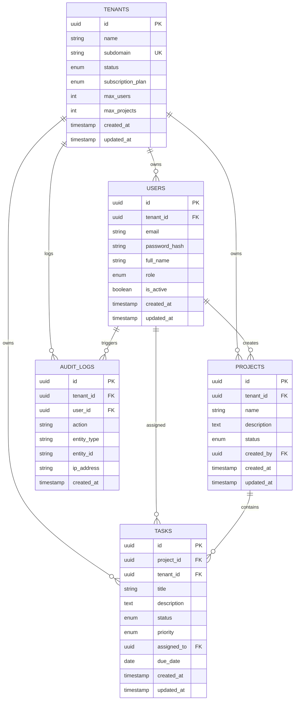
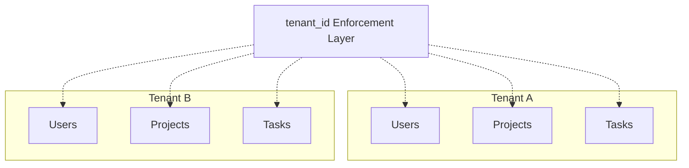

# Architecture Document

## System Architecture Overview

This document describes the architectural design of the multi-tenant task management platform, detailing its layered structure, authentication flow, data isolation strategy, and API organization.

---

## High-Level Architecture



---

## Architecture Layers

### Client Layer
- End users interact with the system through modern web browsers using HTTP or HTTPS.

### Frontend Layer (Port 3000)
- Built with React 18 and bundled using Vite
- Client-side routing handled by React Router
- Route protection enforced through authentication checks
- Responsive and user-friendly interface

### Backend Layer (Port 5000)
- Express.js REST API implemented in TypeScript
- JWT middleware validates authentication tokens
- Role-based access control enforces permissions
- Tenant isolation middleware ensures data segregation
- Standardized error handling and response formats

### Database Layer (Port 5432)
- PostgreSQL 15 used for persistent storage
- Shared-schema multi-tenant design using `tenant_id`
- Prisma ORM for safe and efficient database access
- Automatic migrations and seed execution

---

## Authentication Workflow



---

## Database Design

### Entity Relationship Model



---

## Database Tables Summary

### Tenants
- Stores organization-level metadata
- Each tenant is uniquely identified by a subdomain
- Includes subscription plan and quota information
- Status indicates whether tenant is active or suspended

### Users
- Contains user authentication and profile details
- Linked to tenants via foreign key (NULL for super_admin)
- Enforces uniqueness of email per tenant
- Supports multiple role types

### Projects
- Represents tenant-owned projects
- Created and managed by users
- Supports lifecycle states such as active, archived, and completed

### Tasks
- Individual work items within projects
- Assigned priority and workflow status
- Can be reassigned among users within the same tenant

### Audit Logs
- Records all sensitive and critical system actions
- Captures tenant, user, action type, and source IP
- Used for compliance and security investigations

---

## Tenant Data Isolation



**Isolation Strategy:**
- All tenant-specific tables include a `tenant_id` column
- JWT token supplies tenant context for every request
- Queries are automatically scoped to the tenant
- Super administrators can bypass tenant filtering
- Foreign keys and cascading deletes maintain integrity
- Indexes on tenant_id ensure performance

---

## API Design

### Endpoint Categories

#### Authentication
- POST /api/auth/register-tenant
- POST /api/auth/login
- GET /api/auth/me
- POST /api/auth/logout

#### Tenant Operations
- GET /api/tenants
- GET /api/tenants/:tenantId
- PUT /api/tenants/:tenantId

#### User Operations
- POST /api/tenants/:tenantId/users
- GET /api/tenants/:tenantId/users
- PUT /api/users/:userId
- DELETE /api/users/:userId

#### Project Operations
- POST /api/projects
- GET /api/projects
- PUT /api/projects/:projectId
- DELETE /api/projects/:projectId

#### Task Operations
- POST /api/projects/:projectId/tasks
- GET /api/projects/:projectId/tasks
- PATCH /api/tasks/:taskId/status
- PUT /api/tasks/:taskId
- DELETE /api/tasks/:taskId

#### System
- GET /api/health

---

## API Security Model

### Authentication
- Stateless JWT-based authentication
- Token validity set to 24 hours
- Token transmitted via Authorization header

### Authorization
- Public, authenticated, and role-restricted endpoints
- Role enforcement via RBAC middleware
- Tenant membership validated on every request

### Request Lifecycle
1. Client sends request with JWT
2. Token is validated
3. Role permissions are checked
4. Tenant isolation enforced
5. Controller executes logic
6. Structured response returned

---

## Standard Response Structure

### Success
```json
{
  "success": true,
  "message": "Optional description",
  "data": {}
}
```

### Error
```json
{
  "success": false,
  "message": "Error message"
}
```

---

## HTTP Status Codes

- 200 – OK  
- 201 – Created  
- 400 – Validation Error  
- 401 – Unauthorized  
- 403 – Forbidden  
- 404 – Not Found  
- 409 – Conflict  
- 500 – Server Error  

---

For detailed API specifications, refer to **API.md**.  
For diagram exports, see **images/diagrams.md**.
