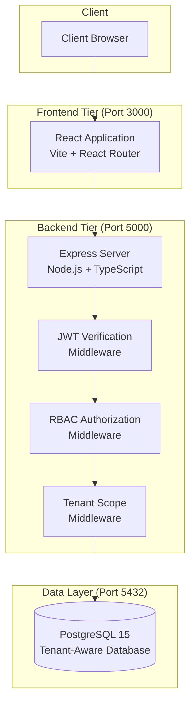
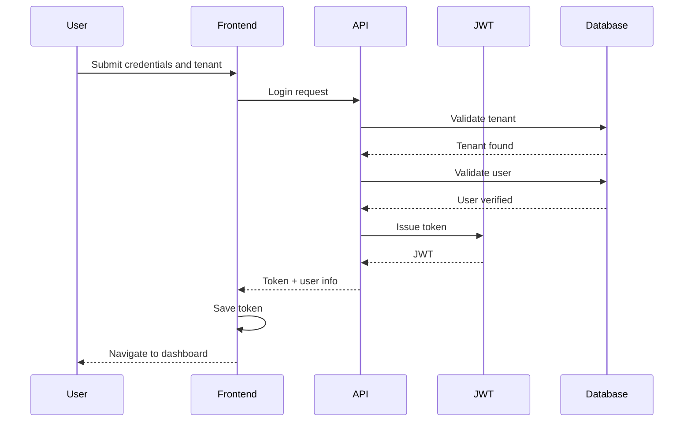
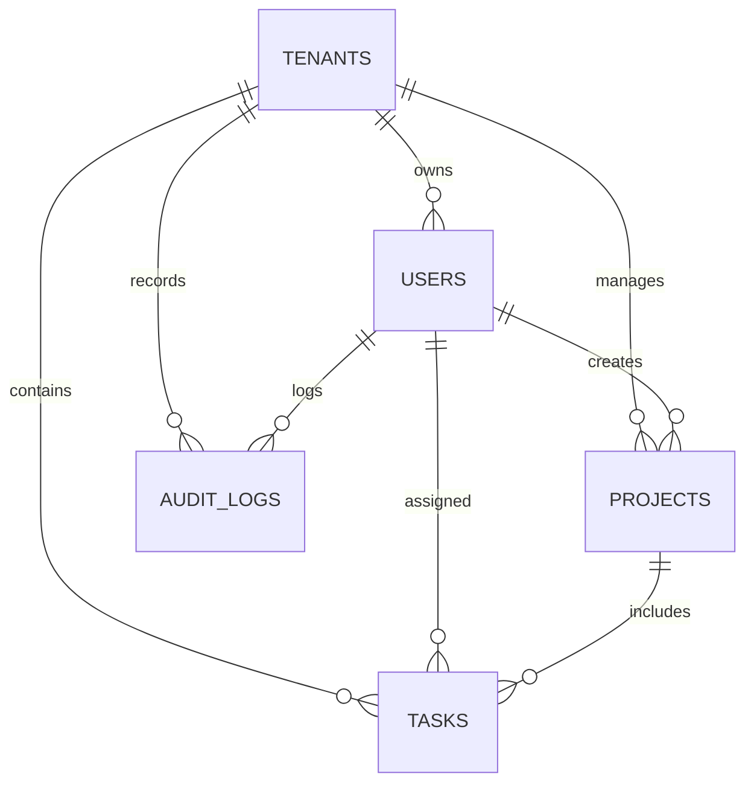
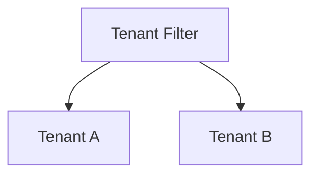

# Architecture Documentation – Version A

## System Design Overview

### High-Level System Architecture



### Component Breakdown

**Client Layer**
- End users interact with the system using standard web browsers over HTTP or HTTPS

**Frontend Layer (3000)**
- Built using React 18 and bundled with Vite
- Client-side routing via React Router
- Secure routes protected by authentication checks
- Adaptive and responsive user interface

**Backend Layer (5000)**
- REST API implemented using Express and TypeScript
- JWT middleware responsible for token validation
- RBAC layer ensures role-specific access
- Tenant middleware enforces data separation
- Centralized error handling across endpoints

**Database Layer (5432)**
- PostgreSQL 15 used for persistent storage
- Multi-tenant design using tenant_id references
- Prisma ORM for database abstraction
- Migration and seed automation

## Authentication Lifecycle



## Database Design

### Entity Relationships



### Table Summary

**tenants**
- Organization-level data
- Unique subdomain per tenant
- Subscription and quota configuration

**users**
- Login and identity records
- Linked to tenants
- Role-based permissions

**projects**
- Project entities scoped to tenants
- Lifecycle controlled via status

**tasks**
- Work items within projects
- Priority and progress tracking

**audit_logs**
- Records security-relevant actions
- Used for compliance and traceability

## Tenant Isolation Model



- All records include tenant_id
- JWT token supplies tenant context
- Super admins bypass tenant restrictions
- Indexed tenant_id for performance

## API Structure

### Core Endpoints

**Auth**
- Register tenant
- Login / Logout
- Fetch current user

**Tenants**
- View and update tenant details
- List all tenants (super admin)

**Users**
- Create, read, update, delete tenant users

**Projects**
- Manage tenant projects

**Tasks**
- Manage project tasks

## Security Model

- Stateless JWT authentication
- 24-hour token validity
- Role and tenant-based authorization
- Layered middleware request processing

## API Responses

Success:
```json
{ "success": true, "data": {} }
```

Failure:
```json
{ "success": false, "message": "Error" }
```
