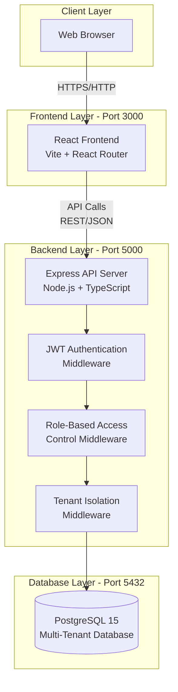
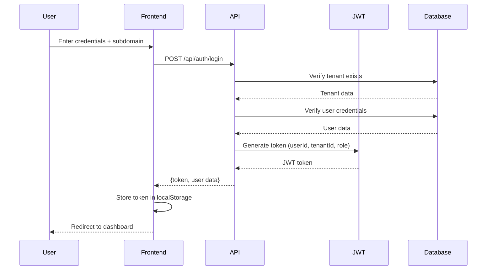
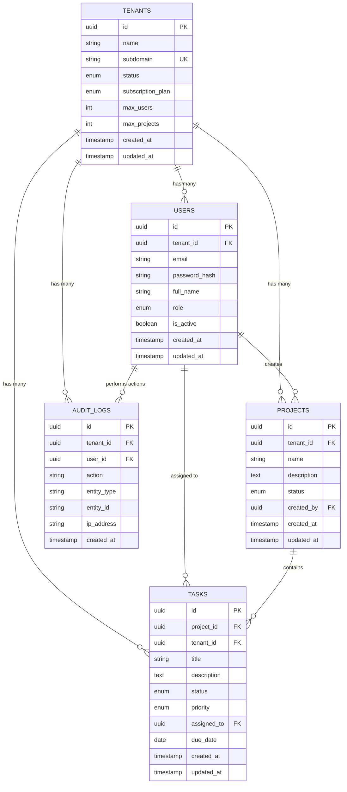
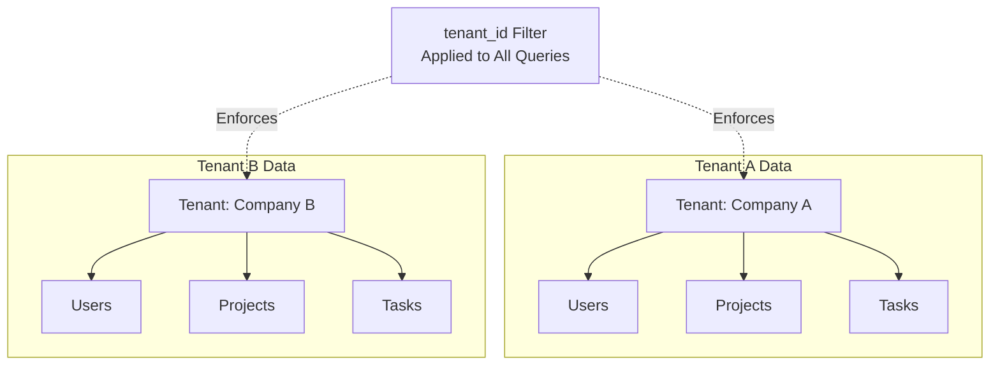

# Architecture Document

## System Architecture

### High-Level Architecture Diagram



### Architecture Components

**Client Layer:**
- Web browsers accessing the application via HTTP/HTTPS

**Frontend Layer (Port 3000):**
- React 18 with Vite build tool
- React Router for client-side routing
- Protected routes with authentication checks
- Responsive UI design

**Backend Layer (Port 5000):**
- Express.js API server with TypeScript
- JWT Authentication Middleware - validates tokens
- Role-Based Access Control - checks user permissions
- Tenant Isolation Middleware - filters data by tenant_id
- RESTful API endpoints
- Consistent error handling

**Database Layer (Port 5432):**
- PostgreSQL 15 for data persistence
- Multi-tenant schema with tenant_id columns
- Prisma ORM for database operations
- Automatic migrations and seeding

### Authentication Flow



## Database Schema Design

### Entity Relationship Diagram



### Database Tables

**1. tenants**
- Stores organization information
- Each tenant has unique subdomain
- Contains subscription plan and limits
- Status: active, suspended, or trial

**2. users**
- User accounts with authentication credentials
- Foreign key to tenants (NULL for super_admin)
- Unique constraint on (tenant_id, email)
- Roles: super_admin, tenant_admin, user

**3. projects**
- Project management records
- Belongs to one tenant
- Created by a user
- Status: active, archived, completed

**4. tasks**
- Task items within projects
- Belongs to both project and tenant
- Can be assigned to users
- Priority: low, medium, high
- Status: todo, in_progress, completed

**5. audit_logs**
- Security and compliance tracking
- Records all important actions
- Includes tenant_id, user_id, action type
- Stores IP address for security

### Data Isolation Strategy



**Isolation Mechanism:**
- Every data record (except super_admin users) has tenant_id
- All queries automatically filtered by tenant_id from JWT token
- Super_admin can access all tenants
- Foreign key constraints with CASCADE delete
- Indexes on tenant_id columns for performance

## API Architecture

### API Endpoint List

#### Authentication Module
- `POST /api/auth/register-tenant` - Register new tenant (public)
- `POST /api/auth/login` - User login (public)
- `GET /api/auth/me` - Get current user (authenticated)
- `POST /api/auth/logout` - User logout (authenticated)

#### Tenant Management
- `GET /api/tenants/:tenantId` - Get tenant details (member or super_admin)
- `PUT /api/tenants/:tenantId` - Update tenant (admin or super_admin)
- `GET /api/tenants` - List all tenants (super_admin only)

#### User Management
- `POST /api/tenants/:tenantId/users` - Add user (tenant_admin)
- `GET /api/tenants/:tenantId/users` - List users (tenant members)
- `PUT /api/users/:userId` - Update user (tenant_admin or self)
- `DELETE /api/users/:userId` - Delete user (tenant_admin)

#### Project Management
- `POST /api/projects` - Create project (authenticated)
- `GET /api/projects` - List projects (authenticated)
- `PUT /api/projects/:projectId` - Update project (creator or tenant_admin)
- `DELETE /api/projects/:projectId` - Delete project (creator or tenant_admin)

#### Task Management
- `POST /api/projects/:projectId/tasks` - Create task (authenticated)
- `GET /api/projects/:projectId/tasks` - List tasks (authenticated)
- `PATCH /api/tasks/:taskId/status` - Update task status (authenticated)
- `PUT /api/tasks/:taskId` - Update task (authenticated)
- `DELETE /api/tasks/:taskId` - Delete task (tenant_admin)

#### System
- `GET /api/health` - Health check (public)

### API Security

**Authentication:**
- JWT-based stateless authentication
- Token expiry: 24 hours
- Token payload: {userId, tenantId, role}
- Authorization header: `Bearer {token}`

**Authorization Levels:**
- **Public**: No authentication required
- **Authenticated**: Valid JWT token required
- **Role-Based**: Specific role required (user, tenant_admin, super_admin)
- **Tenant-Scoped**: User must belong to the tenant

**Request Flow:**
1. Client sends request with JWT token
2. Auth middleware validates token
3. RBAC middleware checks role permissions
4. Tenant isolation middleware filters by tenant_id
5. Controller processes request
6. Response returned with consistent format

### Response Format

**Success Response:**
```json
{
  "success": true,
  "message": "Optional message",
  "data": { /* response data */ }
}
```

**Error Response:**
```json
{
  "success": false,
  "message": "Error description"
}
```

**HTTP Status Codes:**
- 200: Success
- 201: Created
- 400: Bad Request (validation error)
- 401: Unauthorized (not authenticated)
- 403: Forbidden (not authorized)
- 404: Not Found
- 409: Conflict (duplicate resource)
- 500: Internal Server Error

---

For detailed API documentation, see [API.md](./API.md).

For PNG image exports of diagrams, see [images/diagrams.md](./images/diagrams.md).

